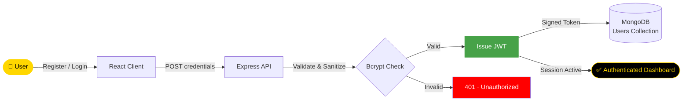

<div align="center">


[](https://git.io/typing-svg)

<br/>

<p align="center">
  <a href="https://github.com/NietoDeveloper">
    
  </a>
  <a href="https://committers.top/colombia#NietoDeveloper">
    
  </a>
  <a href="https://github.com/NietoDeveloper">
    
  </a>
  <a href="https://opensource.org/licenses/MIT">
    
  </a>
</p>

</div>

---

## 📋 Overview

An enterprise-grade, highly secure **User Authentication & Authorization System** built with the modern MERN stack (MongoDB, Express.js, React, Node.js). Engineered with clean architecture principles, robust security protocols, and a production-ready folder structure to deliver seamless user onboarding and session management.

Developed by **Manuel Nieto** (**NietoDeveloper**), ranked **#1 in Colombia** and **#3 in Latin America** on `committers.top`. This application serves as a foundational micro-module demonstrating high-performance backend design and responsive frontend integration.

---

## 🏗️ Repository Architecture

```text
LoginRegister/
├── loginregisterbackend/    # RESTful API, database models, and authentication controllers
└── loginregisterfront/      # Modern React single-page application (SPA) UI
```

---

## 🔄 Authentication Flow



---

## 🚀 Key Features

- **Secure Authentication:** Password hashing using bcrypt and stateless session verification via JSON Web Tokens (JWT).
- **Robust Input Validation:** Strict payload sanitization and error handling across both client and server layers.
- **Scalable Architecture:** Separated concerns following industrial MVC patterns for the backend and component-driven architecture for the frontend.
- **Modern Developer Experience:** Configured with fast bundling, modern ECMAScript standards, and strict typing readiness.

---

## 🛠️ Technology Stack

<div align="center">

| Layer | Technologies |
|:------|:-------------|
| 🎨 **Frontend** | React, JavaScript (ES6+), HTML5, CSS3, Modern UI Components |
| ⚙️ **Backend** | Node.js, Express.js, RESTful APIs |
| 🗄️ **Database** | MongoDB, Mongoose ODM |
| 🔐 **Security & DevOps** | JWT, Bcrypt, CORS, Dotenv, Git |

</div>

---

## 👨‍💻 Author

**Manuel Nieto (NietoDeveloper)**
Role: Full-Stack Software Engineer & Systems Architect
Location: Bogotá, Colombia
Rankings: #1 in Colombia & #3 in Latin America (committers.top)
Portfolio: [manuelnieto.netlify.app](https://manuelnieto.netlify.app)
GitHub: [@NietoDeveloper](https://github.com/NietoDeveloper)

---

## 📄 License

This project is open-source and available under the **MIT License**.

<div align="center">

<br/>


</div>
